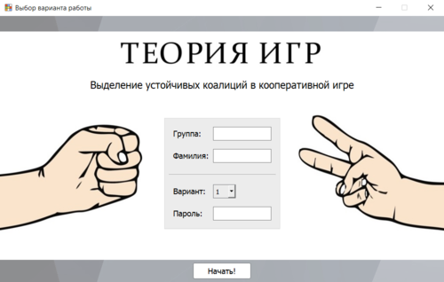
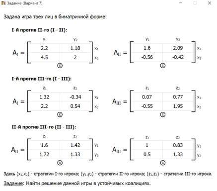
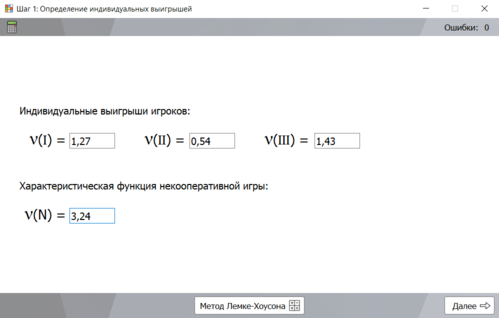
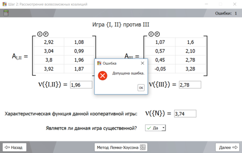
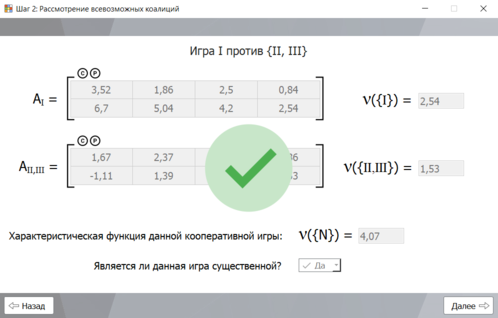
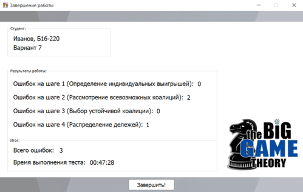

# Forming stable coalitions
Приложение с GUI для тестирования студентов на тему
"Выделение устойчивых коалиций в кооперативных играх"
> В папке [books](https://bitbucket.org/TimofeyKatalnikov/forming_stable_coalitions/src/master/books/)
можно найти файлы с описанием реализованных алогритмов.

## Requirements
---
Требуется **Python 3.5** или более поздняя версия. А также:
```
PyQt5>=5.9.2
numpy>=1.13.3
```

## Build
---
Можно собрать с помощью **pyinstaller**. Например, под Windows:
```
pip install pypiwin32
pip install pyinstaller
pyinstaller --onefile --icon=lib/app_icon.ico --noconsole main.py
```
После чего положить папку **lib** (со стилями, картинками и UI) рядом 
с исполняемым файлом из созданной **pyinstaller** папки **dist**.

## Screenshots
---


 

 

